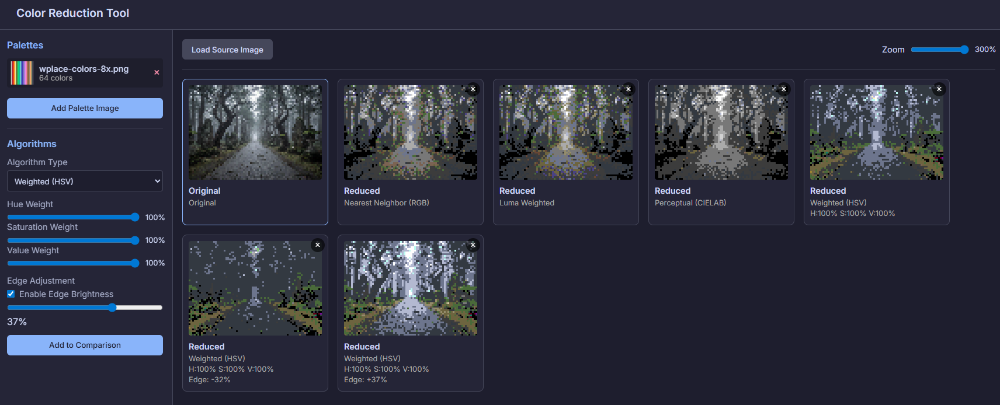

# KabooColorReductionTool

## 概要

このプロジェクトは、指定パレットでの減色を実現するためのものです。

## イメージ

## 使い方

1. index.htmlを開く
2. Load Source Imageで、減色したい画像を開く
3. Add Palette Imageで、減色対象の色が全て格納されている画像を指定する(1024色まで)
4. Algorithmsでアルゴリズムを指定してAdd to Comparisonで比較アルゴリズムに追加する
5. いい感じのアルゴリズム設定があったら、画像をクリックしてSave Imageで保存する

## FAQ

1. 保存フォーマットは？ ⇒ フルカラーアルファ値あり。パレットは保持しません
2. パレットファイルはどこで入手すればいい？ ⇒ 自作か、LOSPEC(PNG Image 8x)とかで入手
3. バグがあった ⇒ AntiGravityで自分でなおし亭なおして

## ライセンス

このプロジェクトは、MITライセンスの下でライセンスされています。

## 免責事項

本ソフトウェアは「現状のまま」提供され、いかなる保証もありません。著者は、本ソフトウェアの使用から生じるいかなる損害についても責任を負いません。

## 更新履歴

* 2025/11/28: とりあえずロンチ
* 2025/12/05: エッジ検出処理とヘルプページを追加
